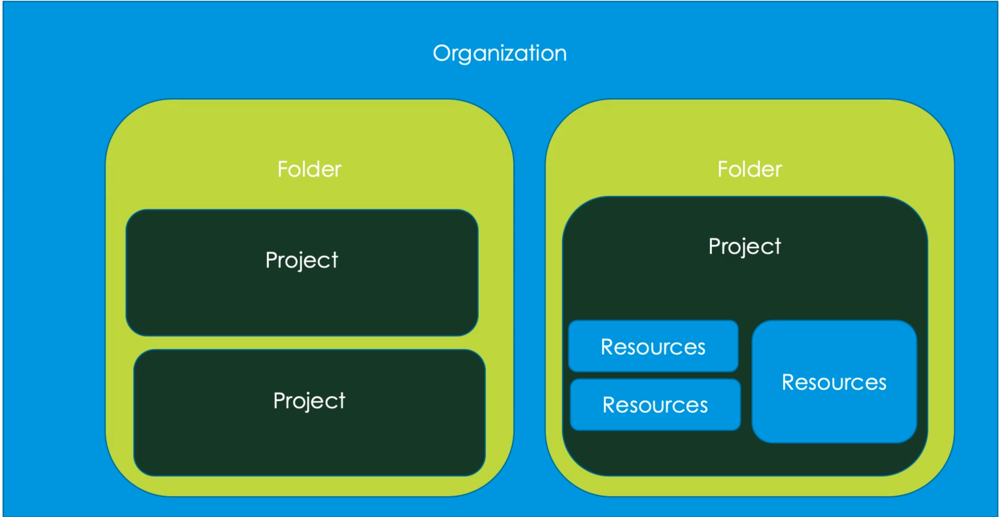
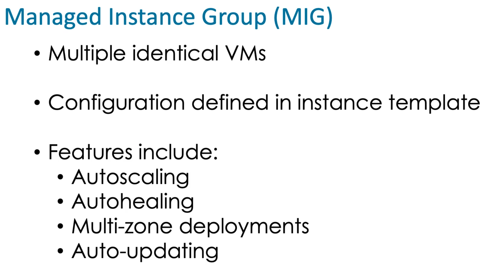
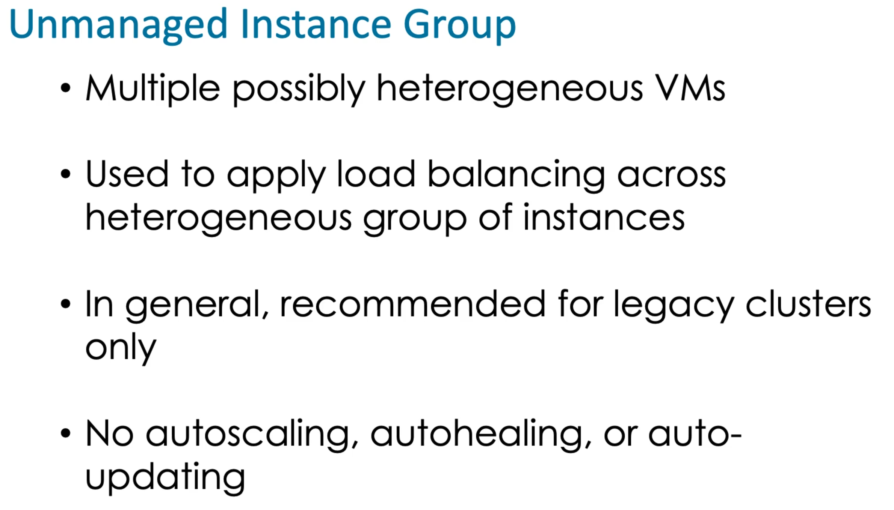
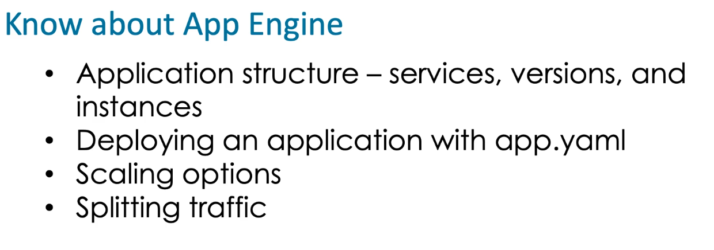
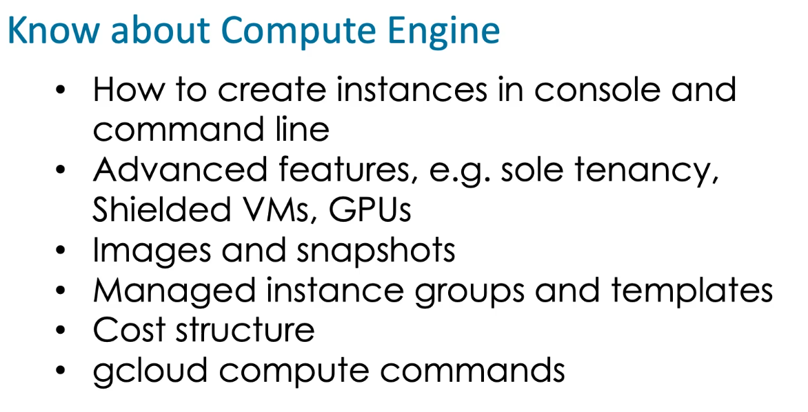
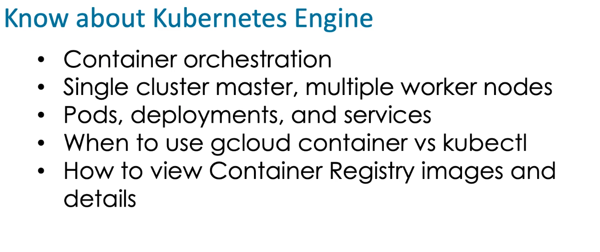
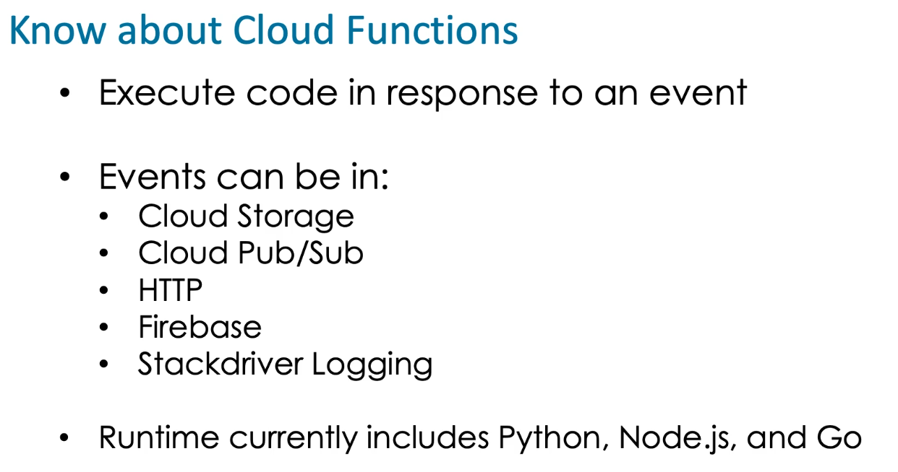
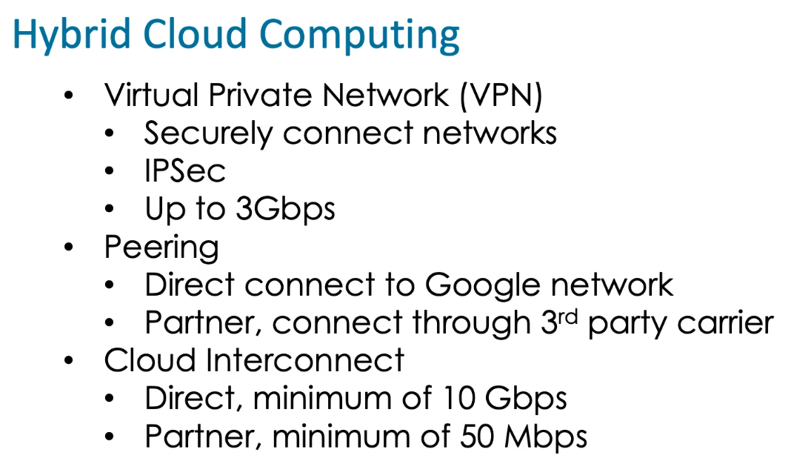
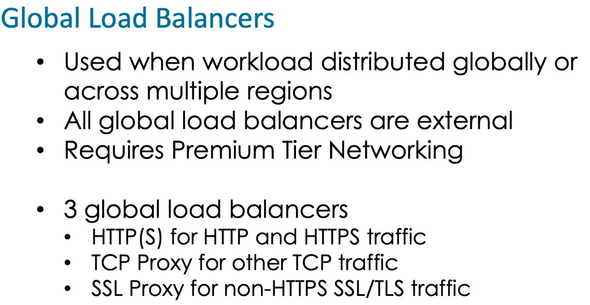
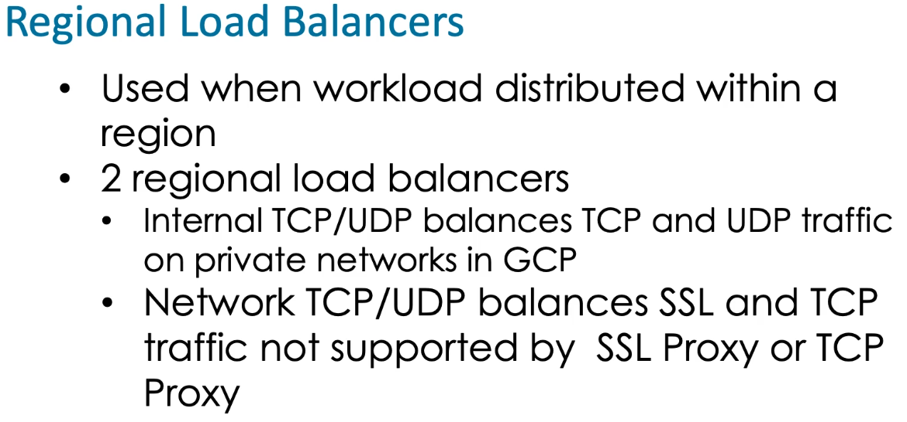

​		Google Assoicate Cloud Engineering

### Table of Content

1. [Compute](#Compute)

2. [Storage](#Storage)

3. [Operations](#Operations)

4. [Tools](#Tools)

5. [BigData](#BigData)

6. [Cloud Shell](#shell)

7. [Resoure Hierarcy](#ResourceHierarcy)

8. [Identity and Access Management (IAM)](#iam)

9. [Instance Group](#instancegroup)

10. [Kubernetes](#Kubernetes)

11. [Cloud Function](#cloudfunction)

12. [What to know about compute](#knowabout)

13. [What to know about Storage](#knowaboutstorage)

14. [Networking](#networking)

15. [Deployment Manager](#DeploymentManager)

16. [Monitoring](#monitoring)

    

## Compute Service  

* **App Engine :** 
  * Platform-as-service
  * Minimal Configuration requirements
* **Compute Engine:**
  * Maximum control and configurability
  * Shiedlded VMS  & Sole Tenancy
* **Kubernetes Engine:**
  * Managed cluster
  * Containerized applications
* **Cloud Functions:**
  * Responding to events in GCP

## Storage 

Classification:

* NOSQL DB
* Relational DB
* File System
* Object System

Storage Services:

* Bigtable : Column, NOSQL DB
* Datastore: Document, NOSQL DB
* Firestore: Document, NOSQL DB
* SQL: Relational DB
* Spanner: Relational DB
* Storage: Stores any sort of data, Unstructured data

## Operations 

* Monitoring
* Debugging
* Trace
* Logging

## Tools 

* Cloud Build
* Cloud Tasks
* Container Registry
* Deployment Manager

## BigData 

* Dataproc
* Dataflow
* BigQuery
* Pub/Sub

## Cloud Shell 

* gcloud
* gsutil : for cloud storage (object storage system)
* bq: command line utility for BigQuery
* cbt: command line utility for big table

## Resource Hierarcy 

Provide attach points and inheritance for access control and organization policie

**Components**

* Organization 

* Folders

* projects

* Resources (vms, buckets, sql, etc)

  

## Identity and Access Management (IAM)  

Represents a user or entity that has privileges to perform actions in GCP.

**4 Types:**

* **Google Account:** Represents person(developer, admin) associated with email

* **Cloud Identity or GSuit Account:** Gsuit is a member of organisation, Cloud Identity is like GSuit domain but without access to Gsuit service

* **Google Group**: Collection of identities. useful for assigning roles to multiple users.

* **Service Account** : Account associated with an application or instance rather than a user, can create as many as needed.

  

### Access Control Concepts

* Resources
* Permissions
* Roles
  * Predefined(created by google)
  * Custom
  * Primitive

### Policies

Collection of statements that define which users have access to some resources

Attcahed to a resource

Roles attached to identities, Policies attached to resources, Policies are hierarchy.

## Instance Group 

Collection of instances that are managed as a single entity

2 Types

* Managed instance group
* Unmanaged instance group

Cool Down period is time allowed for instances to finish initializing

Stabilization period is time autoscaler uses to calculate MIGs recommended target size

Avoids thrashing, i.e. rapidly adding and removing instances

## Kubernetes

Managed service, Provides Kubernetes Clusters.

Kubernetes runs containers on cluster of virtual or physical machines.

Known as container orchestration

**Features:**

* Load balancing of workloads
* Node pools to segment nodes within a cluster
* Automatic scaling and updating
* Autohealing
* Stackdriver monitoring

**Process Objects:**

* Pods
* Deployments
* Services

**Storage Objects**

* Persistent Volumes
* Persistent Volume Claims

**kubectl**

## App Engine

* App Engine Standard 
* App Engine Flexible

## Cloud Function

* Serverless compute service
* Execute code in response to events based on triggers
* Available for events in:
  * Cloud storgare
  * Cloud Pub/Sub
  * HTTP
  * Firebase
  * Stackdriver Logging

### Cloud Function components

* Events
* Trigger
* Functions

## What to know about Compute 

## Storage in GCP

* Object storage

  * cloud storage

* Instance storage

  * Persistent Disks

* Database storage

  * **SQL** - CloudSQL(upto 10GB, regional level scallable), Cloud spanner(horizontally scalable, consistency and users round the old)
  * **NoSQL** - Cloud Datastorage/Firestore(Document Nosql db), Bigtable (Wide Column Db)
  * **Analytic** - BigQuery (Data warehousing, not transactional)

  >  Buckets : Top level structure that holds file and folder.

## What to know about Storage

* Object vs Persistent DISK vs Managed database
* Cloud Storage
  *  4types - regional, multi-regional, headline, Coldline
  * Lifecycle policies
  * **gsutil is for storage**
* Persistent Disks
  * used with VMs
  * Persist data even when VM shuts down
* NoSQL for flexible schema data
  * Datastore/Firestore
  * Bigtable
* Relational for Structured data
  * Cloud SQL upto 10TB
  * Cloud Spanner for global database
* Big Query
  * Data warehousing
  * **Bq command line tool**

## BIG DATA

**Pub/Sub** - Topic, subscription, Acknowledgement

**Cloud Dataproc** - Data processing Hadoop cluster. Is a managed Hadoop and spark service

**Cloud Dataflow** - Choose a template and select the process that you need to do from source to destination.

**Cloud Transfer** - Its used to transfer data from any source (AWS, Google,3rd party, etc) to destination only google cloud platform. 

**Big Query** - It's an analytics used for data warehousing, it used sql query language but not relational database, there are two ways in order to query using **bq** or user interface

## Networking in the cloud

* Virtual Private Clouds (VPC)
  * Private cloud
  * Global resource
  * Subnets in regions 
  * Resources can communictae using private IP addressing
  * Can share VPCs within organization
  * Can peer VPCs across organizations
  * VPC network
* Cloud Router
  * Dynamic Border gateway Portocol (BGP)
  * GCP  to  non-Google networks
* Virtual Private Network (VPN)
  * Securely connect networks
  * Implemented with IPSec (creating Tunnels)
  * Links VPC networks to on-premises network
  * Traffic routed over public internet
  * Up to 3 Gbps
* VPC Peering
  * Private communication links (in different organizations)
  * Between VPCs 
  * Low level network connection
  * Linking networks
  * Traffic routed using BGP
  * Does not use GCP objects
* Shared VPC
  * Share VPC across projects
  * Centrally managed
* Cloud Interconnect
  * Google networking service
  * Connect to Google network
    * Directly, atleast 10Gbps, upto 100 Gbps
    * Partner, from 50 Mbps to 10Gbps
* Firewalls
  * Control flow of traffic

**Load Balancer**

* Global or regional
* External or internal
* Traffic types
* 3 Global
  * Http(s)
  * SSL Proxy
  * TCP Proxy
* 2 Regional
  * Internal TCP/UDP (only internal load balancing)
  * Network TCP/UDP

**Cloud DNS**

**Routes**

## Deployment Manager 

Is a service that allow us to deploy pre configured applications into gcp.

## Monitoring

### Stackdriver

* Observability services
* Monitor application, instances, clusters, services
* Multiple services
  * Monitoring : Used to monitor application about host performance metrix in realtime.
  * Debug: Used by developer to debug
  * Trace: Is distributed tracing tool, is used to analyze perfromance issues in distributed systems and used by developer and devops.
  * Logging: Is the central repo where log lines are written, Strack driver logging agent  collects the log from VM instances and sends them to stackdriver instance and kept for 7days default, if want more should export them to storage.
  * Error Reporting : counting and grouping similier errors 
  * Profiler (APM)

