# 															Kubernetes

-----


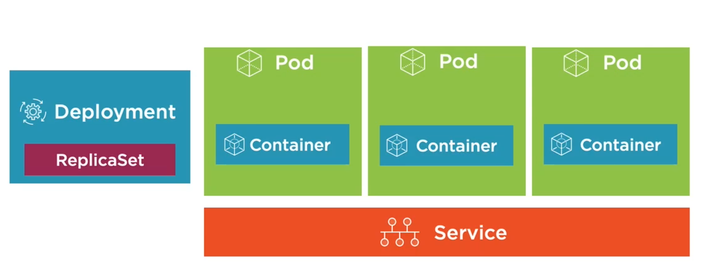

### List Kubernetes CLI commands

```cmd
$ kubectl version

# Run pods
$ kubectl run [podname] --image=imagename:version

# Lists only pods
$ kubectl get pods

# Lists all respources
$ kubectl get all

# Expose a pod port to access the pod
$ kubectl port-forward [name-of-pod] 8080:80

# Will cause pod to be recreated
$ kubectl delete pod [name-of-pod]

# Delete Deployment that manages the pod
$ kubectl delete deployment [name-of-pod-deployment]
```


#### YAML 

* YAML files are composed of maps and lists
* Indentation matters ( be consistence! )
* Always use spaces
* Maps:
  * name: value pairs
  * Maps can contain other maps for more complex data structures
* Lists: 

#### Defining a Pod with YAML

```yaml
apiVersion: v1
kind: Pod
metadata:
 name: mocktailbird-pod
 labels:
  component: web
spec:
 containers:
 - name: mocktailbird-app
   image: mocktailbird_app:latest
   ports:
   - containerPort:8080
```

Creating a Pod Using YAML

```cmd
# Perform a "trial" create and also validate the YAML
kubectl create -f file.pod.yml --dry-run --validate=true

# Create a pod from YAML
# Will error if Pod already exists
kubectl create -f file.pod.yml

# alternate way to create or apply changes to a POD from YAML
kubectl apply -f file.pod.yml

# Use --save-config when you want to use 
# kubectl apply in the future
kubectl create -f file.pod.yml --save-config

# alternate ways to apply 
kubectl edit 
kubectl patch

# Deleting a Pod
kubectl delete pod [name-of-pod]

# Delete Pod using YAML file that created it
kubectl delete -f file.pod.yml

# Shows information about event on pod/image/container
kubectl describe pod [pod-name]

# Go into container of the Pod
kubectl exec [pod-name] -it sh

# edit the pod in cmd
kubectl edit -f file.pod.yml
```

### Health of Pods

Two Types:

1. **Liveness probes:** determine if a Pod is healthy and running as expected

   ```yml
   apiVersion: v1
   kind: Pod
   metadata:
    name: mocktailbird-pod
   spec:
    containers:
    - name: mocktailbird-app
      image: mocktailbird_app:latest
      livenessProbe:
       httpGet:
       	path: /Hello
       	port: 9080
       initialDelaySeconds: 15
       timeoutSeconds: 2
       periodSeconds: 5
       failureThreshold: 1
      ports:
      - containerPort: 9080
   ```

   ExecAction - Executes an action inside the container

   TCPSocketAction - TCP check against the container's IP address on a specified port

   HTTPGetAction - HTTP GET request against container

2. **Readiness probes:** determine if a Pod should receive requests

   ```yml
   apiVersion: v1
   kind: Pod
   metadata:
    name: mocktailbird-pod
   spec:
    containers:
    - name: mocktailbird-app
      image: mocktailbird_app:latest
      readinessProbe:
       httpGet:
       	path: /Hello
       	port: 9080
       initialDelaySeconds: 2
       periodSeconds: 5
      ports:
      - containerPort: 9080
   ```

Failed Pod containers are recreated by default(restartPolicy defaults to Always).

### Replicasets & Deployments

A ReplicaSet is a declarative way to manage Pods

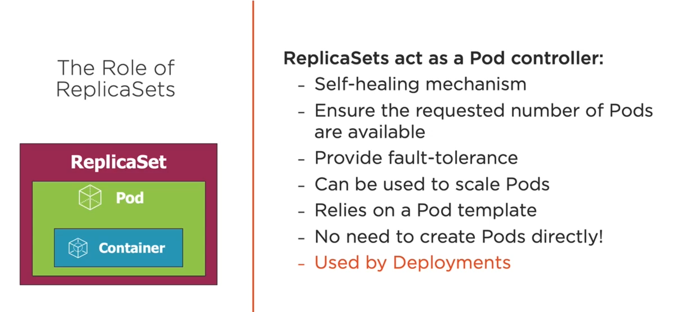

A Deployment is a declarative way to manage Pods using a ReplicaSet

If pod is destroyed the Deployments and ReplicaSets ensure Pods stay running and can be used to scale Pods

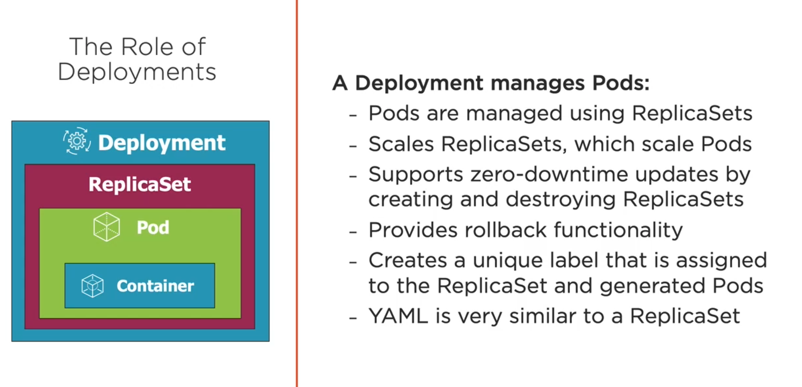

#### Defining a Deployment

Highe level

```yml
apiVersion: apps/v1
kind: Deployment
metadata:
spec:
 selector:
 template:
  spec:
   containers:
   - name: mocktailbird-app
   image: mocktailbird_app:latest 
```

Deep

```yml
apiVersion: apps/v1
kind: Deployment
metadata:
 name: web
 labels:
  app: mocktailbird
  tier: services
spec:
 replicas: 3
 selector:
  matchLabels:
   tier: services
 template:
  metadata:
   labels:
    tier: services
  spec:
   containers:
   - name: mocktailbird-app
   image: mocktailbird_app:latest 
```

```cmd
# Create a Deployment
kubectl create -f file.deployment.yml
kubectl apply -f file.deployment.yml

# getting all deployments
kubectl get deployments

# List all Deployments and their labels
kubectl get deployment --show-labels

# get all deployments with a specific label
kubectl get deployment -l app=mocktailbird

# Delete a Deployment
kubectl delete deployment [deployment-name]

# Scale the Deployment Pods to %
kubectl scale deployment [deployment-name] --replicas=5

# Scale by refencing the YAML file
kubectl scale -f file.deployment.yml --replicas=5
```

### Deployment Option

Zero downtime deployments, update an application's pods without impacting end users

* Rolling updates
* Blue-green Deployments ( AB deployments)
* Canary deployments
* Rollbacks

### Services

Single point of entry for accessing one or more Pods

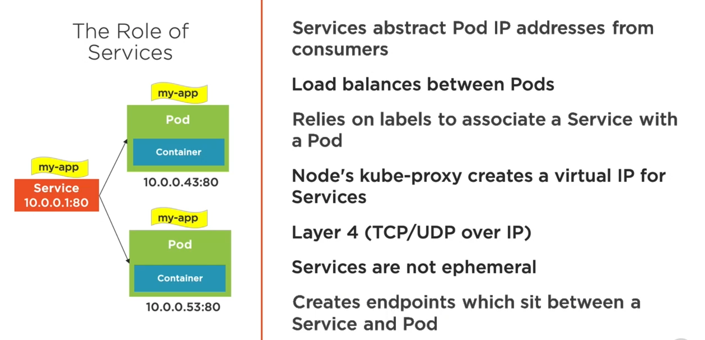

#### Service Types:

- **ClusterIP -** Expose the service on a cluster-internal IP(default), Used to talk in between pods

  ```yml
  apiVersion: v1
  kind: Service
  metadata:
   name: mocktailbird
   labels:
    app: mocktailbird
  spec:
   type: ClusterIP #default
   selector:
    app: mocktailbird
   ports:
   - name: http
     port: 9080
     targetPort: 9080
  ```

  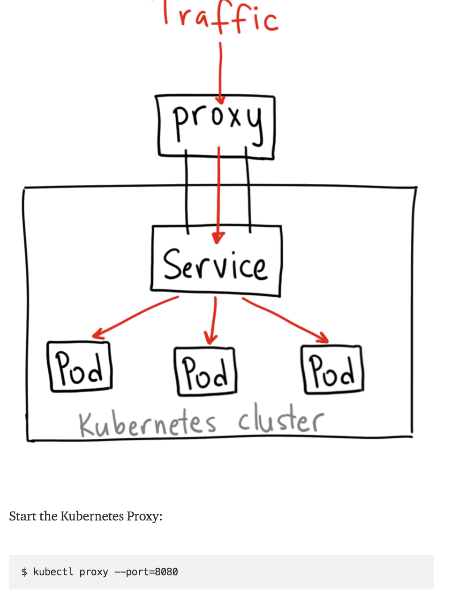

- **NodePort -** Expose the service on each Node's Ip at a static port (starts from 30,000), Used to communicate from outside world.

  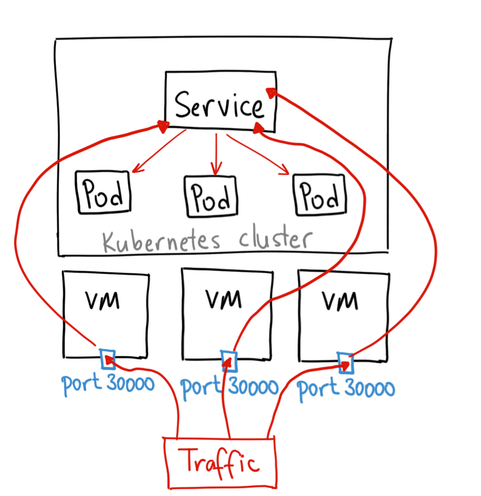

  ```yml
    apiVersion: v1
    kind: Service
    metadata:
      ...
    spec:
     type: NodePort
     selector:
      app: ngnix
     ports:
      - port: 80
        targetPort: 80
        nodePort: 31000 #optional will set default
  ```

- **LoadBalancer -** Provision an external IP to act as a load balancer for the service (make sure cluster is running to see it working)

  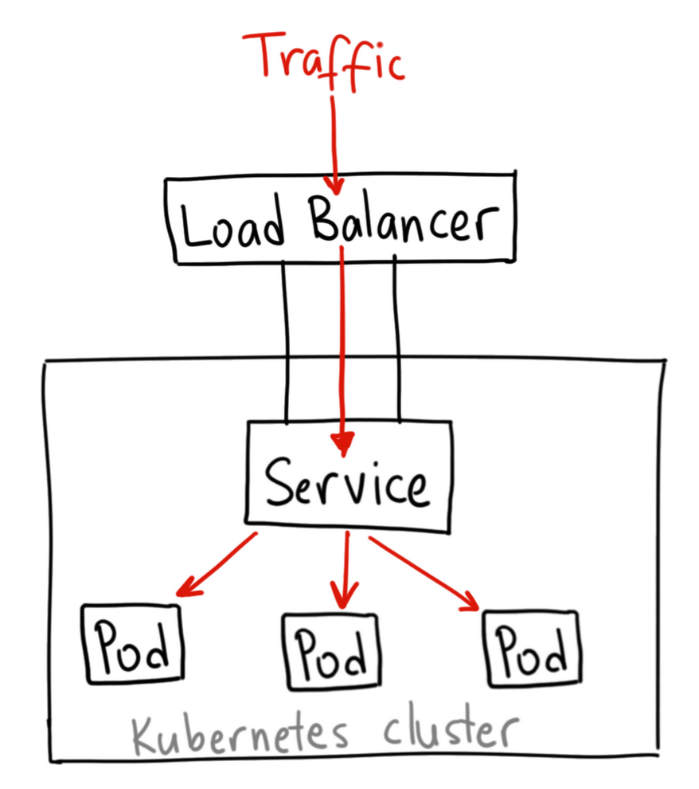

  ```yml
    apiVersion: v1
    kind: Service
    metadata:
      ...
    spec:
     type: LoadBalancer
     selector:
      app: ngnix
     ports:
      - port:80
        targetPort: 80
  ```

  > *Note: LoadBalancer wont work in local (with out cluster setup) use other METALLB setup for testing loadbalancer.*

- **ExternalName -** maps a service to a DNS name

  ```yml
    apiVersion: v1
    kind: Service
    metadata:
     name: external-service
    spec:
     type: ExternalName
     externalName: api.acmecorp.com
     ports:
      - port:80
  ```

  

  ```cmd
  # Listen on port 8080 locally and forward to port 80 in Pod
  kubectl port-forward pod/[pod-name] 8080:80
  
  # Listen on port 8080 locally and forward to Deployment's Pod
  kubectl port-forward deployment/[deployment-name] 8080
  
  # Listen on port 8080 locally and forward to Service's Pod
  kubectl port-forward service/[service-name] 8080
  ```

  #### Service with YAML

  ```yml
  apiVersion: v1
  kind: Service
  metadata:
   name: mocktailbird-pod
  spec:
   containers:
   - name: mocktailbird-app
     image: mocktailbird_app:latest
     livenessProbe:
      httpGet:
      	path: /Hello
      	port: 9080
      initialDelaySeconds: 15
      timeoutSeconds: 2
      periodSeconds: 5
      failureThreshold: 1
     ports:
     - containerPort: 9080
  ```

  ```cmd
  # Create a service
  kubectl create -f file.service.yml --save-congfig
    
  # update a service
  kubectl apply -f file.service.yml
    
  # Delete service
  kubectl delete -f file.service.yml
    
  # shell into a Pod and test a URL. Add -c [containerID]
  # in cases where multiple containers are running in the POD // if curl exists
  kubectl exec [pod-name] -- curl -s http://podIP
       
  ```

  

#### Storage

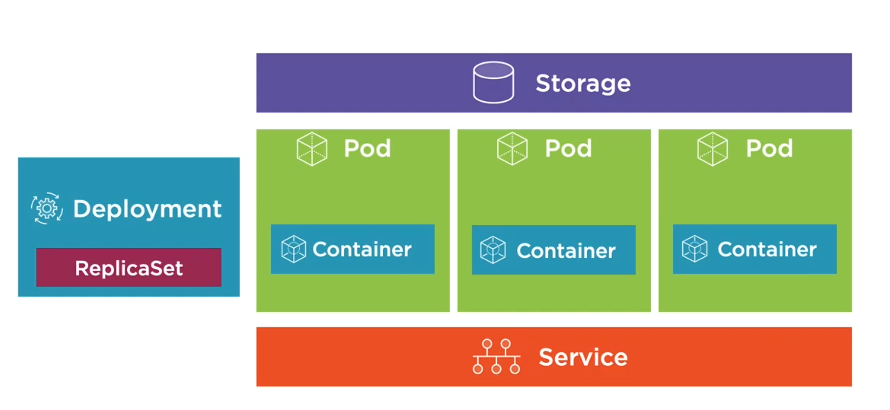

### Volumes

- A volume references a storage location
- Must have a unique name
- Attached to a Pod and may or may not be tied to the Pod's lifetime(depending on the volume type)
- A volume mount reference a Volume by name and defines a mountPath

#### Volume Types

1. **EmptyDir** - Empty directory for storing "transient" data (shares a Pod's lifetime) useful for sharing files between containers running in a Pod.

   ```yml
   apiVersion: v1
   kind: Pod
   spec:
    volumes:
      - name: html
        emptyDir: {}
     containers:
     - name: ngnix
       image: ngnix:alpine
       volumeMounts:
        - name: html
          mountPath: /usr/share/ngnix/html
          readonly: true
     - name: html-update
       image: alpine
       command: ["/bin/sh", "-c"]
       args:
        - while true; do date >> /html/index.html;
           sleep 10; done
       volumeMounts:
        - name: html
          mountPath: /html
   ```

2. **hostPath** - Pod mounts into the node's filesystem

   ```yml
   apiVersion: v1
   kind: Pod
   spec:
    volumes:
      - name: docker-socket
        hostPath:
         path: /var/run/docker.sock
         type: Socket
     containers:
     - name: docker
       image: docker
       command: ["sleep"]
       args: ["10000"]
       volumeMounts:
        - name: docker-socket
          mountPath: /var/run/docker.sock
   ```

3. **nfs** - An NFS (Network File System) share mounted into the Pod

4. **configMap/secret** - Special types of volumes that provide a Pod with access to Kubernetes resources

5. **persistentVolumeClaim** - Provide pods with a more persistent storage option that is abstracted from the details

6. **Cloud** - Cluster-wide storage

   * Azure - Azure Disk and Azure File

     ```yml
     apiVersion: v1
     kind: Pod
     spec:
      volumes:
        - name: data
          azureFile:
           secretnName: <azure-secret>
           shareName: <share-name>
           readOnly: false
       containers:
       - name: my-app
         image: someimage
         volumeMounts:
          - name: data
            mountPath: /data/storage
     ```

     

   * AWS - Elastic Block Store

     ```yml
     apiVersion: v1
     kind: Pod
     spec:
      volumes:
        - name: data
          awsElasticBlockStore:
           volumeID: <volume_ID>
           fsType: ext4
       containers:
       - name: my-app
         image: someimage
         volumeMounts:
          - name: data
            mountPath: /data/storage
     ```

     

   * GCP - GCE Persistent Disk

     ```yml
     apiVersion: v1
     kind: Pod
     spec:
      volumes:
        - name: data
          gcePersistentDisk:
           pdName: datastorage
           fsType: ext4
       containers:
       - name: my-app
         image: someimage
         volumeMounts:
          - name: data
            mountPath: /data/storage
     ```

Viewing a Pod's Volumes

```cmd
# Describe Pod
kubectl describe pod [pod-name]

# Get Pod YAML
kubectl get pod [pod-name] -o yaml
```

#### PersistentVolume( PV )

Is a cluster-wide storage unit provisioned by an administrator with a lifecycle independent from a Pod.

A PersistentVolumeClaim (PVC) is a request for a storage unti(PV)

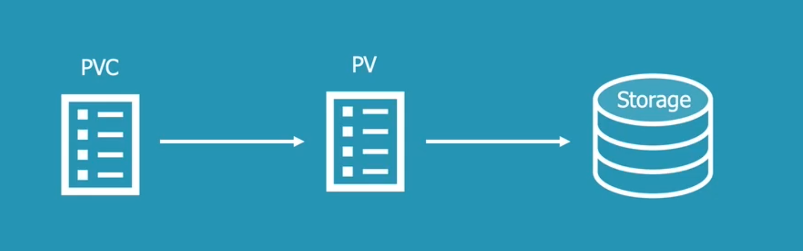

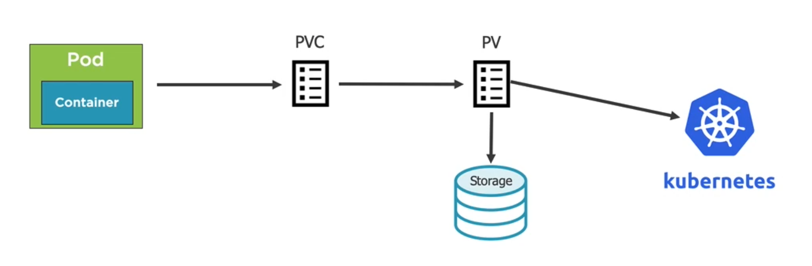

[ PV examples ](https://github.com/kubernetes/examples)

Defining a Persistent Volume for Azure

```yml
apiVersion: v1
kind: PersistentVolume
metadata:
 name: my-pv
spec:
 capacity: 10Gi
 accessModes:
  - ReadWriteOnce
  - ReadOnlyMany
 persistentVolumeRelaimPolicy: Retain
 azureFile:
  secretName: <azure-secret>
  shareName: <name_from_azure>
  readOnly: false
```

Defining a PersistentVolumeClaim

```yml
apiVersion: v1
kind: PersistentVolume
metadata:
 name: pv-dd-account-hdd-5g
 annotations:
  volume.beta.kubernetes.io/storage-class: accounthdd
spec:
 accessModes:
 - ReadWriteOnce
 resources:
  requests:
   storag: 5Gi
```

Using a PersistentVolumeClaim

```yml
apiVersion: v1
kind: Pod
metadata:
 name: pod-uses-account-hdd-5g
 labels:
  name: storage
spec:
 containers:
 - image: nginx
   name: az-c-01
   command:
   - /bin/sh
   - -c
   - while true; do ech0 $(date) >>
     /mnt/blobdisk/outfile; sleep 1; done
   volumeMounts:
   - name: blobdisk01
     mountPath: /mnt/blobdisk
 volumes:
 - name: blobdisk01
   persistentVolumeClaim:
    claimName: pv-dd-account-hdd-5g
```

#### StorageClass

A StorageClass (SC) is a type of storgae template that can be used to dynamically provision storage.

 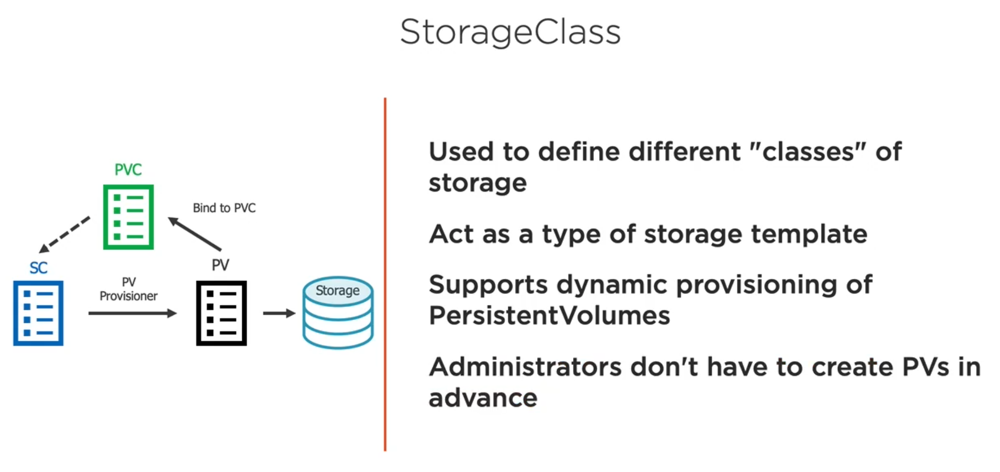

Defining a Local Storage StorageClass

```yml
apiVersion: storage.k8s.io/v1
kind: StorageClass
metadata:
 name: local-storage
reclaimPolicy: Retain
provisioner: kubernetes.io/no-provisioner
volumeBindingMode: WaitForFirstConsumer
```

Defining a Local Storage PersistentVolume

```yml
apiVersion: v1
kind: PersistentVolume
metadata:
 name: my-pv
spec:
 capacity:
  storage: 10Gi
 volumeMode: Block
 accessModes:
 - ReadWriteOnce
 storgaeClassname: local-storage
 local:
  path: /data/storage
 nodeAffinity:
  required:
   nodeSelectorTerms:
   - matchExpressions:
     - key: kubernetes.io/hostname
       operator: In
       values:
       - <node-name>
```

Defining a PersistentVolumeClaim

```yml
apiVersion: v1
kind: PersistentVolumeClaim
metadata:
 name: my-pvc
spec:
 accessModes:
 - ReadWriteOnce
 storageClassName: local-storage
 resources:
  requests:
   storage: 1Gi
```

Using a PersistentVolumeClaim

```
apiVersion: apps/v1
kind: [Pod | StatefulSet | Deployment]
...
 spec:
  volumes:
  - name: my-volume
    persistentVolumeClaim:
     claimName: my-pvc
```

### ConfigMaps

ConfigMaps provide a way to store configuration information and provide it to containers

Can store entire files or provide key/value pairs:

* Store in a File. Key is the filename, value is the file contents( can be son, xml, keys/values, etc).
* Provide on the command-line
* ConfigMap manifest

Accessing ConfigMap Data in a Pod

1) Environment variables (key/value)

2) Configmap Volume (access as files)


### Creating ConfigMap

#### Defining Values in a ConfigMap Manifest

```yml
apiVersion: v1
kind: ConfigMap
metadata:
 name: app-settings
 labels:
  app: app-settings
data:
 enemies: aliens
 lives: "3"
 enemies.cheat: "true"
 enemies.cheat.level=noGoodrooten
```

```cmd
# Create from a ConfigNap manifest
kubectl create -f file.configmap.yml
```

#### Defining key/value pairs in a file

```text
#File name game-config
enemies=aliens
lives=3
enemies.cheat=true
enemies.cheat.level=noGoodRooten
```

```cmd
# Create a ConfigMap using data from a file
kubectl create configmap [cm-name] --from-file=[path-to-file]
```

Above command generetas a configfile as below

```yml
apiVersion: v1
kind: ConfigMap
data:
 # file name of the keyvalue pay and delimter
 game.config: |-  
  enemies=aliens
  lives=3
  enemies.cheat=true
  enemies.cheat.level=noGoodrooten
```

#### Defining Key/Value Pairs in an Env File

```text
# File name game-config.env
enemies=aliens
lives=3
enemies.cheat=true
enemies.cheat.level=noGoodRooten
```

```cmd
# Create a env ConfigMap using data from a file
kubectl create configmap [cm-name] --from-env-file=[path-to-file]
```

Above command generetas a configfile as below

```yml
apiVersion: v1
kind: ConfigMap
data:
 # Note file name is not included here
 enemies=aliens
 lives=3
 enemies.cheat=true
 enemies.cheat.level=noGoodrooten
```

Recap

```cmd
# Create a Configmap Using data from a config file
kubectl create configmap [cm-name] --from-file=[path-to-file]

# Create a ConfigMap from an env file
kubectl create configmap [cm-name] --from-env-file=[path-to-file]

# Create a ConfigMap from individual data values
kubectl create configmap [cm-name] --from-literal=apuUrl=https://my-api --from-literal=otherKey=otherValue

# Cretae from a ConfigMap manifest
kubectl create -f file.configmap.yml

# Get a ConfigMap
kubectl get cm [cm-name] -o yaml  
```

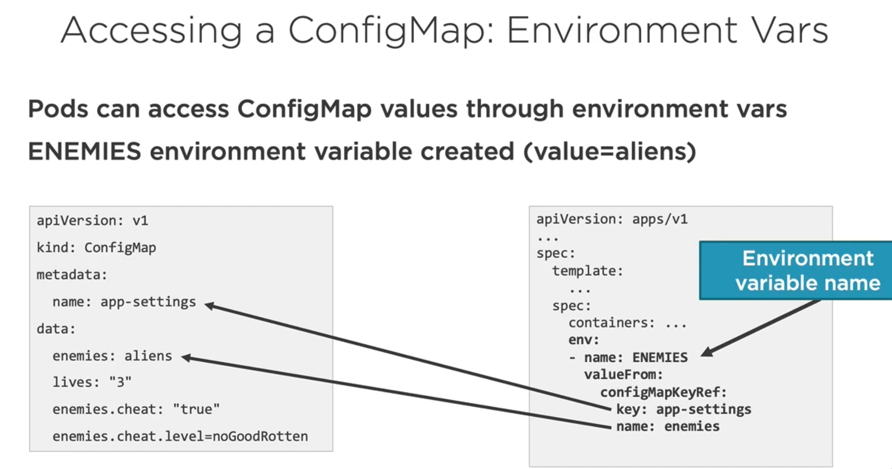

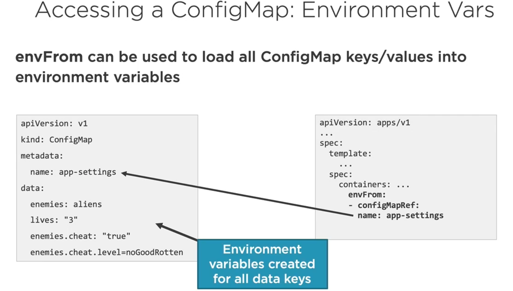

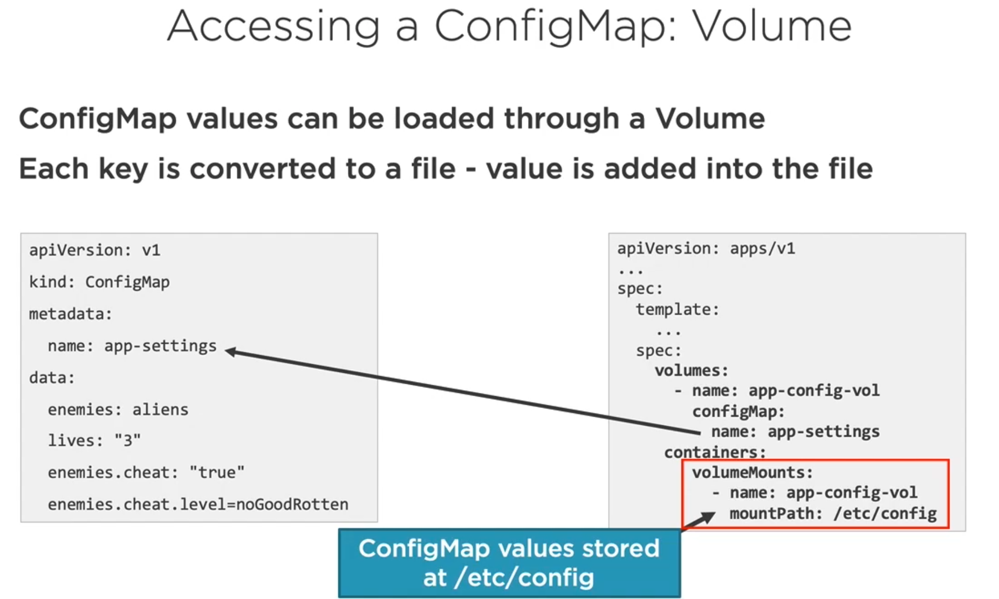

### Secret

A secret is an object that contains a small amount of sensitive data such as a password, a token, or a key.

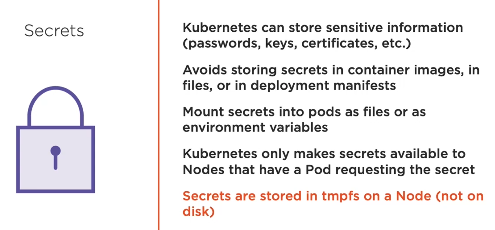


#### Create a Secret

```cmd
# Create a secret and store securely in kubernetes
kubectl create secret generic my-secret --from-literal=pwd=my-password

# Create a secret from a file
kubectl create secret generic my-secret --from-file=ssh-privatekey=~/.ssh/id_rsa --from-file=ssh-publickey=~/.ssh/id_rsa.pub

# Create a secret from a key pair
kubectl create secret tls tls-secret --cert=path/to/tls.cert --key=path/to/tls.key
```

**Question** : Can I declaratively define secrets using YAML?

**Answer** : Yes -but any secret data is only base64 encoded in the manifest file! 

#### Defining a Secret in YAML

```yml
apiVersion: v1
kind: Secret
metadata:
 name: db-passwords
type: Opaque
data:
 app-password: cGFzc3dvc=
 admin-password: dmVyeeduu8ifisHDHJK=
```

```cmd
# Get Secrets
kubectl get secrets

# Get YAML for specific secret
kubectl get secrest db-passwords -o yaml
```

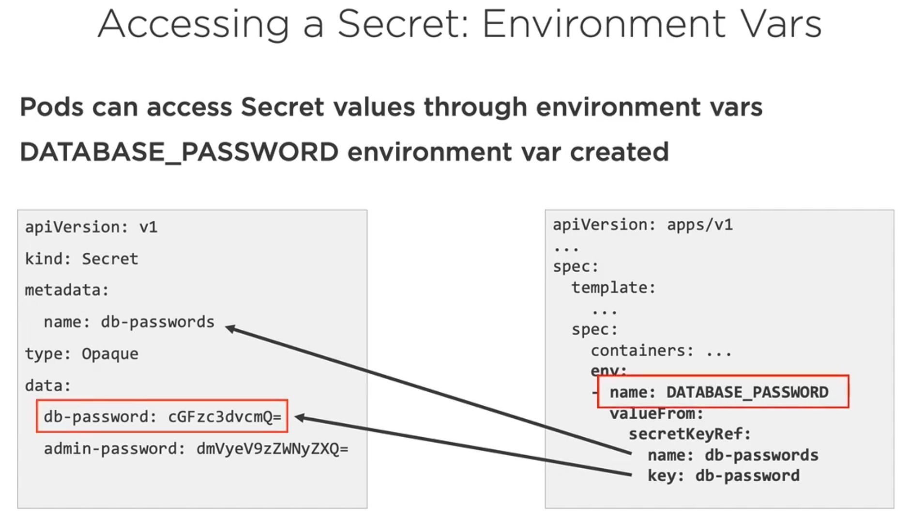

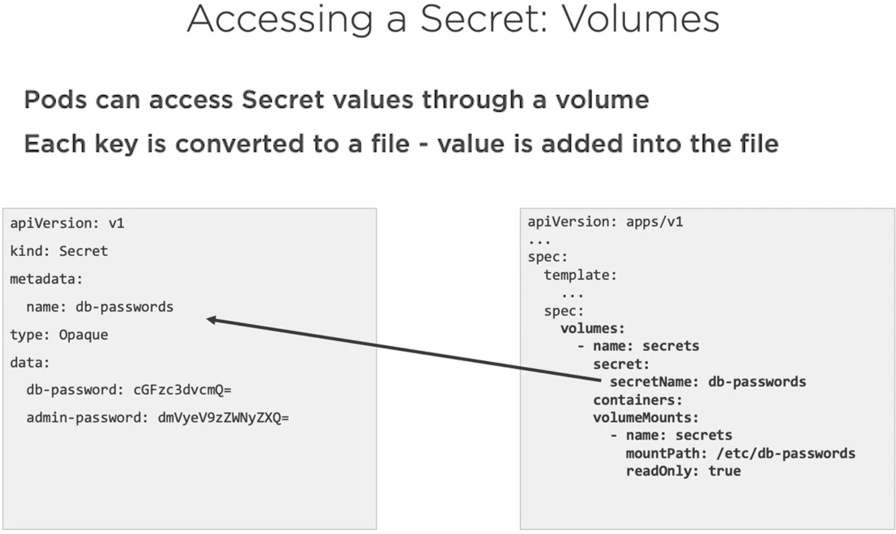

### Troubleshooting

```cmd
# View the logs for a Pod's container
kubectl logs [pods-name]

# View the logs for a specific container within a Pod
kubctl logs [pod-name] -c [container-name]

# View the logs for a previously running pod
kubectl logs -p [pod-name]

# Stream a Pod's logs
kubectl logs -f [pod-name]

```

```cmd
# Describe a Pod
kubectl describe pod [pod-name]

# Change a Pod's output format
kubectl get pod [pod-name] -o yaml

# Change a Deploment's output format
kubectl get deployment [deployment-name] -o yaml

# Shell into a Pod container
kubectl exec [pod-name] -it sh

```

